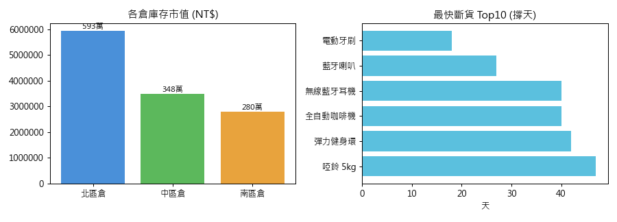

# 倉儲報告 — 全倉體檢

> 產生時間：2026-06-25T00:56:14　資料快照：2026-05-26　產生者：agent_auto（trace rpt-2026-06-25T00:56:14）

## 一、庫存總覽
| 倉別 | 總件數 | 庫存市值 |
| --- | --- | --- |
| 北區倉 | 14,461 | NT$ 5,933,237 |
| 中區倉 | 8,265 | NT$ 3,476,209 |
| 南區倉 | 6,579 | NT$ 2,803,008 |

- SKU 總數：60　- 低於安全庫存品項：41

## 二、缺貨警示（撐天 / 建議補）
| 商品 | 倉 | 現量 | 撐天 | 建議補 |
| --- | --- | --- | --- | --- |
| 電動牙刷 | 中區倉 | 14 | 18 | 13 |
| 藍牙喇叭 | 南區倉 | 20 | 27 | 11 |
| 彈力健身環 | 北區倉 | 30 | 28 | 42 |
| 啞鈴 5kg 一對 | 南區倉 | 20 | 33 | 26 |
| 全自動咖啡機 | 南區倉 | 22 | 33 | 4 |
| 彈力健身環 | 南區倉 | 27 | 35 | 45 |
| 無線藍牙耳機 | 中區倉 | 42 | 40 | 10 |
| 全自動咖啡機 | 中區倉 | 24 | 40 | 2 |
| 彈力健身環 | 中區倉 | 45 | 42 | 27 |
| 啞鈴 5kg 一對 | 中區倉 | 41 | 47 | 6 |
| 輕量羽絨外套 | 北區倉 | 13 | 55 | 27 |
| 登山水壺 1L | 南區倉 | 66 | 56 | 16 |
| 電動牙刷 | 南區倉 | 15 | 64 | 10 |
| USB-C 快充線 2M | 中區倉 | 71 | 76 | 81 |
| 防蚊液 | 南區倉 | 100 | 78 | 33 |
| 迷你果汁機 | 南區倉 | 22 | 82 | 14 |
| 彈性運動內衣 | 南區倉 | 52 | 82 | 29 |
| 無線藍牙耳機 | 南區倉 | 44 | 88 | 7 |
| USB-C 快充線 2M | 南區倉 | 70 | 95 | 81 |
| 濾掛咖啡 20入 | 南區倉 | 80 | 100 | 52 |
| 防曬遮陽帽 | 南區倉 | 93 | 103 | 9 |
| USB-C 快充線 2M | 北區倉 | 56 | 112 | 95 |
| 露營馬克杯 | 南區倉 | 60 | 112 | 31 |
| 咖啡濾紙 100入 | 南區倉 | 103 | 114 | 39 |
| 14吋筆電包 | 南區倉 | 40 | 120 | 21 |
| 嬰兒紙尿布 L | 中區倉 | 138 | 121 | 4 |
| 牛仔長褲 男款 | 南區倉 | 37 | 123 | 24 |
| 玻璃保鮮盒 5入 | 南區倉 | 53 | 132 | 18 |
| 不鏽鋼悶燒罐 | 南區倉 | 23 | 138 | 17 |
| 機能排汗衣 | 中區倉 | 100 | 200 | 11 |
## 三、保存期限警示
| 商品 | 倉 | 剩餘天數 | 數量 |
| --- | --- | --- | --- |
| 🔴 氣泡水 500ml | 北區倉 | 3 | 586 |
| 🔴 蜂蜜檸檬茶 600ml | 南區倉 | 5 | 48 |
| 🔴 精釀啤酒 6入 | 中區倉 | 6 | 40 |
| 🟠 全麥蘇打餅 200g | 北區倉 | 10 | 191 |
| 🟠 嬰兒濕紙巾 | 南區倉 | 12 | 38 |
| 🟠 綜合堅果罐 500g | 中區倉 | 14 | 8 |
| 🟡 電解質運動飲 | 南區倉 | 22 | 45 |
| 🟡 蚊香液補充瓶 | 中區倉 | 25 | 43 |
| 🟡 熱可可粉 300g | 北區倉 | 28 | 49 |
## 四、採購對帳異常（PO 短收）
（無異常）

---
*本報告由倉管 Agent 自動產生 · rpt-2026-06-25T00:56:14*